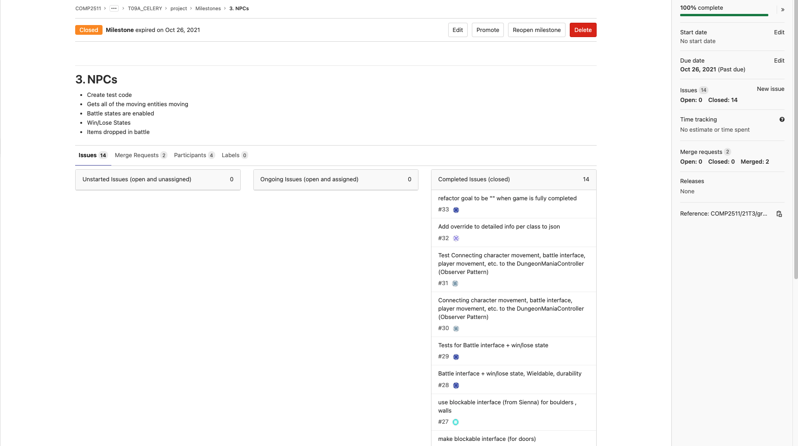
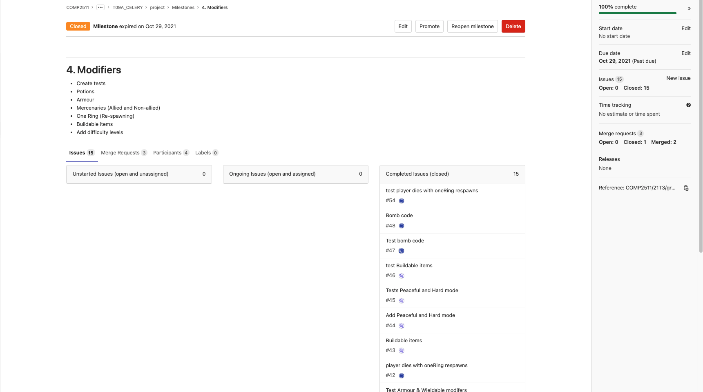

# Project Management

## Meeting and Communication Practices
We held regular meetings weekly during our lab (Tuesdays 9 am - 12 pm) and on Saturday from 6 pm to 8 pm, and had asynchronous stand-ups due on Wednesdays at 11:59 pm. Most of our meetings were hosted on Zoom initially but then we transitioned to communicating mostly on Teams.

All of our meeting minutes (and their version history) can be found here https://drive.google.com/drive/folders/1bNIcmgyiNA4Eks9Zof6m9aqyeGC_KKcI?usp=sharing.

## Timeline and Task Allocation
Using GitLab as our primary issue tracker, we had planned our development timeline to span five milesontes.
1. MVP v1 (18th October 2021)
2. Enviroment Enabilisation (26th October 2021)
3. NPCs (26th October 2021)
4. Modifiers (29th October 2021)
5. Final Checks and Clean up (30th October 2021)
6. MVP2 Fixes & Writing Tests for Milestone 3 (6th November 2021)
7. Implementation of Milestone 3 Post Test Development (10th November 2021)
8. Base Milestone 3 Integration Tests & Final Fixes (Non-Extension) (13th November 2021)
9. Extension Development (13th November 2021)
10. Extension Final Checks & Repository Clean up (14th November 2021)

We mainly believed as a team to structure it this way (i.e. the obscure naming of Milestone 1), to develop and iterate our code over time based on our conceptual application of our design (presented in our UML for Milestone 1). It was bound to change over time, hence we needed to stage our milestones to be more iterative and adaptable. Down below are screenshots of Gitlab describing what is required of each milestone.

<em>Update for Milestone 3</em>: From Milestone 2 onwards, we observed that there was still a lot of fixing and more test code to be developed, so we basically broke our remaining time to accomodate for that as seen with our GitLab milestones (from 5 onwards). Milestones 6 and 7 for Gitlab took a lot more time than anticipated as we were still uncovering our errors in relation to the autotesting which delayed our extension development. We were able to complete Extensions Tasks 1 and 2 except 3 as a result of these delays. However we managed to finish the bulk of our targeted work on time, with at most a day's delay. This was achieved as we aimed to complete our work at earlier dates so there is a buffer at the end of the project to complete tasks, such as this document!

### Milestones (For Milestone 2)

#### MVP v1

#### Environment Enabilisation

#### NPCs

#### Modifiers

#### Final Checks & Clean up

### Milestones (For Milestone 3)

####  MVP2 Fixes & Writing Tests for new M3 things

#### Implementation of Milestone 3 Post Test Development

#### Base Milestone 3 Integration Tests & Final Fixes (Non-Extension)

#### Extension Development

#### Extension Final Checks & Repository Clean up

### Partition of Tasks (GitLab Board)
Our team used GitLab Issues and its default Kanban Board to manage overall contribution and tracking of our progess towards our Milestones. We mostly stuck with it throughout the project so far, however near the first project deadline we went half a day to day over our planned (internal) deadlines. This was caused due to internal miscommunication and some tasks taking longer than expected.

However, the buffer we created over the weekend managed to soften the blow just a bit to get most things in working order and shape.

In regards to splitting tasks, we mainly negiotated our capacity and what interests us, and came to a mutual agreement that the work we are contributing is roughly equal. Down below is a snapshot of our board near the first project deadline.

#### GitLab Board

## Git Practices
Initialy we took an approach where we shared our MVP v1 branch together to place our initial design right, and then we split our branches off feature/milestone related wise. For every merge, we did a merge request and maintained that at least one person needs to verify each merge request before a merge can be committed. For our final cleanup, we then created a Beta-Master branch to tie everything up together to ensure the system was indeed functional before submission.
